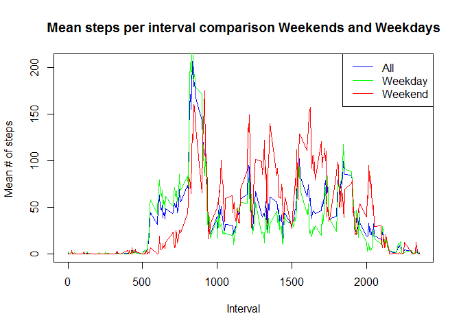

# Reproducible Research: Peer Assessment 1


## Loading and preprocessing the data


```r
  #setwd("E:/Development/R/repData/RepData_PeerAssessment1")
  if (!file.exists("activity"))
  {
    dir.create("activity")
    if (file.exists("activity.zip"))
    {
      message("Unzipping dataset")
      unzip("activity.zip", exdir= "./activity")
    }
  }
  stepData <- read.csv("activity/activity.csv")
  stepData$date <- as.Date(stepData$date)
  
  names(stepData) <- c("Steps","Date","Interval")
```

## What is mean total number of steps taken per day?
 

* The mean total number of steps taken per day is 9354.2295 steps.  
* The median total number of steps taken per day is 10395 steps.

###Daily Mean


```r
#split data by date
dailySteps <- split(stepData$Steps,stepData$Date)
dailyMean <- sapply(dailySteps,FUN=mean)
# Convert to DF for formatting and printing
meanDF <- data.frame(Date= names(dailyMean), mean = dailyMean,row.names = NULL)
names(meanDF) <- c("Date","Mean")
print(meanDF, digits=4)
```

```
##          Date    Mean
## 1  2012-10-01      NA
## 2  2012-10-02  0.4375
## 3  2012-10-03 39.4167
## 4  2012-10-04 42.0694
## 5  2012-10-05 46.1597
## 6  2012-10-06 53.5417
## 7  2012-10-07 38.2465
## 8  2012-10-08      NA
## 9  2012-10-09 44.4826
## 10 2012-10-10 34.3750
## 11 2012-10-11 35.7778
## 12 2012-10-12 60.3542
## 13 2012-10-13 43.1458
## 14 2012-10-14 52.4236
## 15 2012-10-15 35.2049
## 16 2012-10-16 52.3750
## 17 2012-10-17 46.7083
## 18 2012-10-18 34.9167
## 19 2012-10-19 41.0729
## 20 2012-10-20 36.0938
## 21 2012-10-21 30.6285
## 22 2012-10-22 46.7361
## 23 2012-10-23 30.9653
## 24 2012-10-24 29.0104
## 25 2012-10-25  8.6528
## 26 2012-10-26 23.5347
## 27 2012-10-27 35.1354
## 28 2012-10-28 39.7847
## 29 2012-10-29 17.4236
## 30 2012-10-30 34.0938
## 31 2012-10-31 53.5208
## 32 2012-11-01      NA
## 33 2012-11-02 36.8056
## 34 2012-11-03 36.7049
## 35 2012-11-04      NA
## 36 2012-11-05 36.2465
## 37 2012-11-06 28.9375
## 38 2012-11-07 44.7326
## 39 2012-11-08 11.1771
## 40 2012-11-09      NA
## 41 2012-11-10      NA
## 42 2012-11-11 43.7778
## 43 2012-11-12 37.3785
## 44 2012-11-13 25.4722
## 45 2012-11-14      NA
## 46 2012-11-15  0.1424
## 47 2012-11-16 18.8924
## 48 2012-11-17 49.7882
## 49 2012-11-18 52.4653
## 50 2012-11-19 30.6979
## 51 2012-11-20 15.5278
## 52 2012-11-21 44.3993
## 53 2012-11-22 70.9271
## 54 2012-11-23 73.5903
## 55 2012-11-24 50.2708
## 56 2012-11-25 41.0903
## 57 2012-11-26 38.7569
## 58 2012-11-27 47.3819
## 59 2012-11-28 35.3576
## 60 2012-11-29 24.4688
## 61 2012-11-30      NA
```

###Daily Median

```r
dailyMeadian <- sapply(dailySteps,FUN=median)
medianDF <- data.frame(Date= names(dailyMeadian), median = dailyMeadian,row.names = NULL)
names(medianDF) <- c("Date","Median")
print(medianDF, digits=4)
```

```
##          Date Median
## 1  2012-10-01     NA
## 2  2012-10-02      0
## 3  2012-10-03      0
## 4  2012-10-04      0
## 5  2012-10-05      0
## 6  2012-10-06      0
## 7  2012-10-07      0
## 8  2012-10-08     NA
## 9  2012-10-09      0
## 10 2012-10-10      0
## 11 2012-10-11      0
## 12 2012-10-12      0
## 13 2012-10-13      0
## 14 2012-10-14      0
## 15 2012-10-15      0
## 16 2012-10-16      0
## 17 2012-10-17      0
## 18 2012-10-18      0
## 19 2012-10-19      0
## 20 2012-10-20      0
## 21 2012-10-21      0
## 22 2012-10-22      0
## 23 2012-10-23      0
## 24 2012-10-24      0
## 25 2012-10-25      0
## 26 2012-10-26      0
## 27 2012-10-27      0
## 28 2012-10-28      0
## 29 2012-10-29      0
## 30 2012-10-30      0
## 31 2012-10-31      0
## 32 2012-11-01     NA
## 33 2012-11-02      0
## 34 2012-11-03      0
## 35 2012-11-04     NA
## 36 2012-11-05      0
## 37 2012-11-06      0
## 38 2012-11-07      0
## 39 2012-11-08      0
## 40 2012-11-09     NA
## 41 2012-11-10     NA
## 42 2012-11-11      0
## 43 2012-11-12      0
## 44 2012-11-13      0
## 45 2012-11-14     NA
## 46 2012-11-15      0
## 47 2012-11-16      0
## 48 2012-11-17      0
## 49 2012-11-18      0
## 50 2012-11-19      0
## 51 2012-11-20      0
## 52 2012-11-21      0
## 53 2012-11-22      0
## 54 2012-11-23      0
## 55 2012-11-24      0
## 56 2012-11-25      0
## 57 2012-11-26      0
## 58 2012-11-27      0
## 59 2012-11-28      0
## 60 2012-11-29      0
## 61 2012-11-30     NA
```


## What is the average daily activity pattern?


```r
intervalsplit <- split(stepData$Steps,stepData$Interval)
meanStepsInterval <- sapply(intervalsplit, mean,na.rm=TRUE)
plot(names(meanStepsInterval), meanStepsInterval , type = "l", 
main = "Mean steps per interval for all days",  xlab = "Interval", ylab = "Mean # of steps "  )
```

 

```r
#Find the Maximum Value and interval
maxIntervalValue <- max(meanStepsInterval, na.rm = TRUE)
maxInterval <- names(meanStepsInterval)[which.max(meanStepsInterval)]
```
The 5-minute interval (on average) occurs at 835 and contains  206.1698 steps


## Imputing missing values

The number of missing values is 2304

Missing values will be replaced by the mean value for that 5-minute interval


```r
stepsByDayMean <- aggregate(Steps ~ Interval, FUN=mean,data=stepData)
stepsMerged <- merge (x=stepData,y=stepsByDayMean,by="Interval")
stepsMerged$NewSteps <- ifelse(is.na(stepsMerged$Steps.x),stepsMerged$Steps.y,stepsMerged$Steps.x)
stepsNew <- stepsMerged[c("NewSteps","Date","Interval")]
stepsNewByDay <- aggregate(x = stepsNew$NewSteps , by = list(stepsNew$Date), FUN = sum ,na.rm=TRUE)
names(stepsNewByDay) <- c("Date","Steps")
hist(stepsNewByDay$Steps, xlab="number of steps", main="Total number of steps taken each day",col="gray")
```

 

## Are there differences in activity patterns between weekdays and weekends?


```r
#Get Weekend averages
weekendStepData <- stepData[weekdays(stepData$Date) %in% c("Saturday","Sunday"), ]
weekendintervalsplit <- split(weekendStepData$Steps,weekendStepData$Interval)
weekendmeanStepsInterval <- sapply(weekendintervalsplit, mean,na.rm=TRUE)

#Get Weekday averages
weekdayStepData <- stepData[!(weekdays(stepData$Date) %in% c("Saturday","Sunday")), ]
weekdayintervalsplit <- split(weekdayStepData$Steps,weekdayStepData$Interval)
weekdaymeanStepsInterval <- sapply(weekdayintervalsplit, mean,na.rm=TRUE)

plot(names(meanStepsInterval), meanStepsInterval , type = "l", 
main = "Mean steps per interval comparison Weekends and Weekdays",  xlab = "Interval", 
ylab = "Mean # of steps ",col="blue"  )
lines(names(weekdayintervalsplit), weekdaymeanStepsInterval , col="green")
lines(names(weekendintervalsplit),weekendmeanStepsInterval,col="red")
legend("topright", c("All","Weekday", "Weekend"), col = c("blue","green", "red"), lty = 1)
```

 

